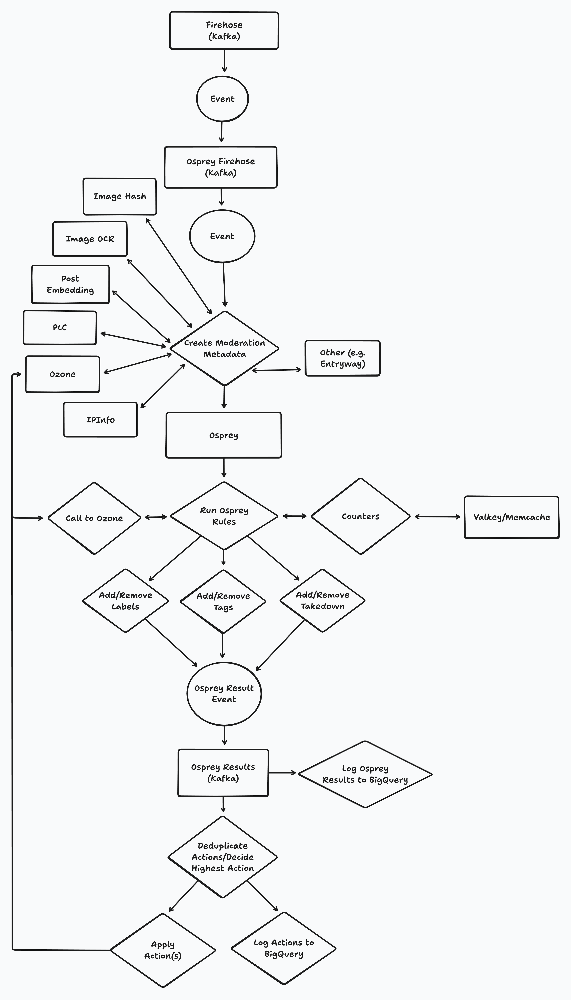

# Osprey for ATProto

> [!NOTE]
> This repo is currently a "working proof of concept", as two things are currently missing: a. a firehose to Kafka producer and b. a clean
> way to customize the input stream. I will a. add the firehose producer later, and b. determine what the best path forward is for the 
> input stream.

This repository contains a set of tools that will let you get started with using [Osprey](https://github.com/roostorg/osprey) with ATProto.

## Architecture



## Getting Started

This repository contains the following:

- A Go firehose to Kafka producer, which allows Osprey to consume the firehose.
- A Go Osprey effects receiver, which takes actions in [Ozone](https://github.com/bluesky-social/ozone) based on the outputs of Osprey.
- A set of ATProto-specific UDFs, as well as a standard library of UDFs that we find useful here at Bluesky.
- An example ruleset for use with Bluesky.

### Clone the Osprey repo

Clone the Osprey repository to your local machine like so:

```bash
git clone git@github.com:roostorg/osprey.git
```

### Add osprey-atproto as a submodule inside of Osprey

```bash
cd osprey
git submodule add git@github.com:bluesky-social/osprey-atproto.git
```

### Update the root pyproject.toml with the new ruleset

```toml
# Add to existing items
[tool.uv.sources]
...
plugins_atproto = { workspace = true }

[tool.uv.workspace]
members = [
   ...,
   "osprey-atproto/plugins_atproto",
]

[tool.ruff.lint.isort]
known-first-party = [..., "osprey-atproto/plugins_atproto"]

[tool.mypy]
...

mypy_path = [
   ...,
   "osprey-atproto/plugins_atproto/src",
]
```

### Update entrypoint.sh

```sh
cli-osprey-worker() {
   # Switch out the --rules-path
    exec uv run python3.11 osprey_worker/src/osprey/worker/cli/sinks.py run-rules-sink --input kafka --output stdout --rules-path ./osprey-atproto/rules_atproto
}
```

## Development

Once you have set up your Osprey repo with this repo as a submodule, you should be able to develop UDFs and rules nicely. For information about
writing rules, see `rules_atproto/README.md`. For information about writing UDFs, see `plugins_atproto/README.md`.

Additional information on making changes to Osprey can be found [in the Osprey repo](https://github.com/roostorg/osprey/blob/main/docs/DEVELOPMENT.md). For
more information about writing rules and how they work, see [the README in the Osprey repo](https://github.com/roostorg/osprey/blob/main/docs/rules.md), or


## FAQ

As we field more questsion from the community, we will update this FAQ section. For now, here are the things we expect people to ask the most.

### What is Osprey?

Osprey is [Discord's](https://discord.com/) open-source event stream decisions engine and analysis UI designed to investigate and take automatic
action on events and their properties as they happen in real-time. Originally developed internally at Discord to combat spam, abuse, botting,
and scripting across our platform, Osprey has now been open-sourced to help other platforms facing similar challenges.

Osprey is a library for processing actions through human written rules and outputting labels, webhooks back to an API and other sinks. It
evaluates events using structured logic (SML), user-defined functions (UDFs), and external signals to assign labels, verdicts, and actions.

### Does Bluesky use Osprey?

Bluesky has slowly been moving many of our internally maintained automod rules to use Osprey. As we work through this process, we are
open-sourcing the pieces that let us connect the ATProto network to Osprey, so that others in the ecosystem can also use Osprey with Bluesky or
their own ATProto applications.

### Why are you not opensourcing all of the rules you use at Bluesky?

We keep our internal ruleset private in an effort to prevent bad actors from circumventing the protections that we currently have in place and
are continuously adding to the network.
